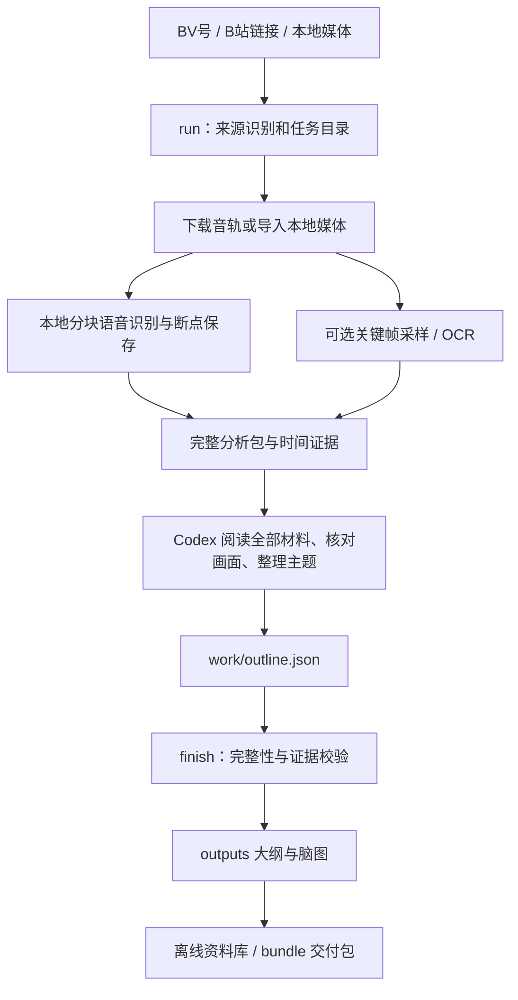

# bili-video-insight

把 B站视频或本地音视频整理成**带时间点的文字大纲与思维导图**，作为独立命令行工具和 Codex Skill 使用。直接获取音轨并在本地转写，无需平台字幕。

**日常操作：给 Codex 一个视频链接 → 自动准备材料 → Codex 阅读并整理 → 打开资料库查阅结果。**

命令行负责下载、转写、抽帧与导出；内容分析由 Codex 完成。只有运行 `run` 并不代表大纲已经生成。当前版本没有独立的聊天模型 API 集成或网页上传界面。

## 目录

- [首次安装](#首次安装)
- [日常使用](#日常使用)
- [结果存在哪里](#结果存在哪里)
- [处理逻辑](#处理逻辑)
- [恢复与常见问题](#恢复与常见问题)
- [开发与发布](#开发与发布)

## 首次安装

需要 Python 3.10+、[uv](https://docs.astral.sh/uv/getting-started/installation/) 和 FFmpeg。macOS 可以先执行：

```bash
brew install uv ffmpeg
mkdir -p ~/Code/skills
cd ~/Code/skills
git clone https://github.com/jerry-wang12/bili-video-insight.git
cd bili-video-insight
uv sync --extra asr
./bili doctor
```

Linux 通过系统包管理器安装 `ffmpeg`，再执行相同的克隆和 `uv sync` 步骤。`bili` 启动器目前支持 macOS/Linux。首次转写会下载 Whisper 模型，需要联网、磁盘空间和等待时间；后续任务共用模型缓存。无需填写模型 API Key。

安装为 Codex Skill：

```bash
mkdir -p ~/.codex/skills
ln -s "$PWD" ~/.codex/skills/bili-video-insight
```

如果目标已经存在，先检查是否已指向此项目，勿覆盖其他 Skill。重新打开 Codex 会话后使用。`./bili` 需要在项目目录执行；也可以从任何目录调用 `~/Code/skills/bili-video-insight/bili`。

## 日常使用

### 推荐：直接告诉 Codex

```text
使用 $bili-video-insight 分析 https://www.bilibili.com/video/BV1wZcVevENV/，
结合音频和关键画面生成详细文字大纲、思维导图，存入默认资料库。
```

本地素材同样可以指定绝对路径。Skill 会准备材料、读取完整分析包、核对画面、撰写有证据的大纲，并运行 `finish`。图片脑图属于可选产物，完整可编辑版本始终保留。

### 命令行：一条命令准备材料

```bash
# 音频分析（默认 small 模型、中文识别）
./bili run BV1wZcVevENV

# 同时准备关键画面，每 60 秒采样一次
./bili run BV1wZcVevENV --mode video

# 本地音视频；语言和模型可以调整
./bili run /absolute/path/video.mp4 --mode video --language en --model small
```

命令结束会打印任务目录，例如 `~/Documents/Bili-Video-Insight/tasks/BV1wZcVevENV/40e4ca171712/`。状态是 `awaiting_analysis`。把**实际打印的任务目录**交给 Codex：

```text
使用 $bili-video-insight 继续分析这个任务目录：<实际任务目录>。
读取 work/analysis-packets 中全部材料并核对关键帧，生成 work/outline.json，完成导出。
```

Codex 生成大纲后，手动导出或打包也很简单：

```bash
./bili finish /absolute/path/to/task
./bili bundle /absolute/path/to/task
./bili list
```

`finish` 验证完整转写和大纲证据 ID 后导出四种文件；`bundle` 只打包这四种交付物。`list` 重建离线目录页并打印路径。macOS 打开默认资料库：

```bash
open ~/Documents/Bili-Video-Insight/index.html
```

## 结果存在哪里

**默认资料库：`~/Documents/Bili-Video-Insight/`。** 源码留在 `~/Code/skills/bili-video-insight/`，运行数据不能写进代码仓库。

```text
Bili-Video-Insight/
├── index.html                       # 所有任务的离线目录：标题、状态、入口
├── cache/models/                    # 所有新任务共用的模型下载缓存
└── tasks/
    └── BV1wZcVevENV/                 # 来源 ID；本地文件用内容摘要标识
        └── <参数摘要>/              # 相同来源与参数复用；变化时创建独立任务
            ├── task.json            # 参数、创建时间、状态；无 Cookie
            ├── index.html           # 此任务的结果入口和错误信息
            ├── work/                # 下载媒体、转写、分块缓存、分析包、采样帧
            │   ├── manifest.json
            │   ├── transcript.json / .txt / .srt
            │   ├── analysis-packets/
            │   ├── frames/
            │   └── outline.json     # Codex 撰写、有证据引用的分析源文件
            └── outputs/             # 查阅与分享的交付区
                ├── outline.md       # 带时间点的文字大纲
                ├── mindmap.md       # 可编辑 Markdown 脑图
                ├── mindmap.mm       # FreeMind 格式，可导入兼容软件
                ├── mindmap.html     # 离线展开/收起，支持浏览器打印
                └── deliverables.zip # bundle 生成的四文件交付包
```

规则：

1. **查阅先打开资料库 `index.html`**，再进入任务；长标题不参与目录命名。
2. **分享用 `outputs/deliverables.zip`**；原始转写、媒体、凭据和模型不进入交付包。完整转写仅留在 `work/`，其交付仍受材料权限和适用内容规则约束。
3. 相同来源、模型、语言、模式、抽帧间隔与清晰度复用同一任务；参数变化产生新目录。短链接按输入 URL 标识，不保证与 BV号合并。`--new` 强制新建版本，旧任务保留。
4. `processing` 为处理中；`blocked` 表示失败；`awaiting_analysis` 为材料就绪、待分析；`completed` 为大纲已验证并渲染，仍需核对内容准确性。
5. 任务保留全部中间材料以支持恢复；工具不会自动清理磁盘。本地导入引用原文件，不复制，移动原文件前先考虑后续复核需要。

改变资料库位置可以单次指定或设置环境变量，优先级为 `--library` → `BILI_INSIGHT_HOME` → 默认路径：

```bash
./bili run BV1wZcVevENV --library /absolute/path/video-library
./bili list --library /absolute/path/video-library
export BILI_INSIGHT_HOME=/absolute/path/video-library
```

已有低层 `fetch/transcribe/render --out …` 命令继续可用，独立目录不会自动出现在新资料库里。具体参数和大纲格式见 [运行文档](references/workflow.md)。

## 处理逻辑



- **媒体获取**：yt-dlp 获取正常权限内的媒体，ffprobe 记录时长与流，SHA256 校验素材一致性。
- **语音识别**：faster-whisper 默认 `small`、CPU int8，按 600 秒分块；保存绝对时间和稳定证据编号，已完成块可恢复。
- **画面分析**：FFmpeg 采样，Codex 逐帧核对；Tesseract OCR 可选。采样不能保证覆盖全部画面文字。
- **语义整理**：依据全部分析包组织论点、推理、例子与结论；每个叶节点至少引用一个真实转写或画面 ID。ID 校验只证明引用存在，不能证明解释正确。
- **导出与查阅**：所有主题保留到文字与脑图文件，任务页及资料库索引不依赖服务器或 CDN。

参考 [Bili-Insight](https://github.com/2951121599/Bili-Insight) 的「材料 → 总结 → 可视化」思路。本项目自行实现音轨转写、关键帧证据与本地资料库；未复制其代码。

## 恢复与常见问题

| 情况 | 处理方法 |
| --- | --- |
| 首次运行慢 | 首次需下载模型，长视频的本地 ASR 也需要时间；不同任务共享模型缓存 |
| 转写中断 | 重新运行原来的 `run` 命令，已完成的音频块复用；同一任务不允许同时运行两次 |
| 修改参数或想重新分析 | 修改参数会创建另一任务；同参数重做用 `--new`；只改大纲后重新 `finish` |
| 下载 403/412、登录或地区限制 | 查看任务页错误；正常权限条件改变或提供本地素材后再试，不自动换身份或反复重试 |
| 用户需要传 Cookie | 显式 `--cookies /private/path/cookies.txt`；不自动读浏览器；建议副本，yt-dlp 可能更新文件 |
| 中文术语、人名识别不准 | 用上下文与画面复核，保留原始转写，单独记录勘误；tiny 仅适合管线验证 |
| 很长视频抽帧超上限 | 默认最多 120 帧，增大 `--interval`，或用低层 `frames --times …` 明确选择时间点 |
| 为什么只有材料没有脑图 | `run` 到材料准备为止；让 Codex 分析，再 `finish` |
| 想要全部画面文案 | 需要更密采样、检测和人工核验；当前默认流程仅承诺关键画面 |

`doctor` 报告依赖路径和可选模块状态；缺少 ASR 时执行 `uv sync --extra asr`，缺少 FFmpeg 时先安装系统依赖。默认 ASR 在本地执行；Codex 内容分析依照当前 Codex 会话的数据处理方式。OCR 需自行安装 Tesseract 及 `chi_sim`、`eng` 语言包。

## 开发与发布

```bash
uv sync --extra asr --extra dev
./bili --help
uv run --no-sync pytest
uv run --no-sync ruff check scripts tests
```

只发布代码、Skill、测试和文档；媒体、模型、Cookie、环境文件与用户运行材料不提交。普通更新使用 `git pull` 后重新 `uv sync --extra asr`；旧任务与原始产物保留，可用 `--new` 创建独立任务验证新版本。

原创代码采用 MIT 许可，依赖遵循各自许可。
